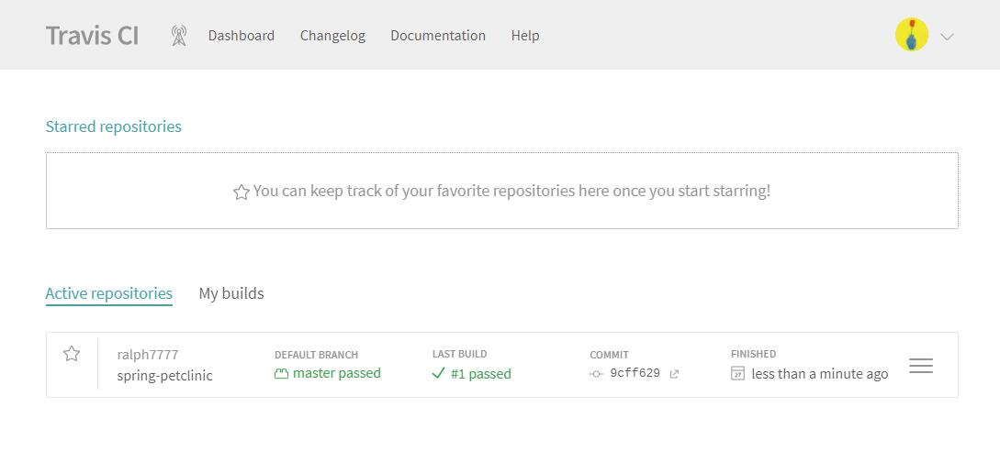
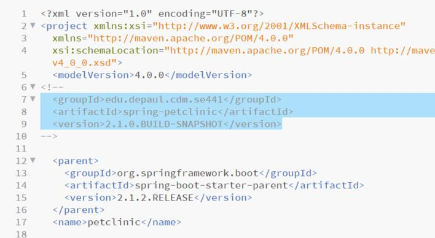

Deliverables

1. Github account showing that is has been forked from the depaulcdm/springpetclinic repository.

2. Travis CI dashboard showing a successful first build.

3. The section of the POM file showing the coordinates after changing them.

4. Travis CI dashboard showing a successful build after change of the group ID.

5. The section of the POM file showing the coordinates after commenting them out.

6. Travis CI dashboard showing the unsuccessful build after the breaking change.

7. Github repository with the readme.md file selected showing the build failed status after the Travis CI build fails.

8. The section of the POM file showing the coordinates after fixing them.

9. Travis CI dashboard showing the successful build after the breaking change has been fixed.

10. Github repository with the readme.md file selected showing the build success status after the Travis CI build has recovered.

