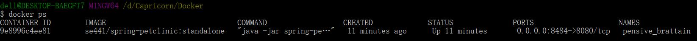
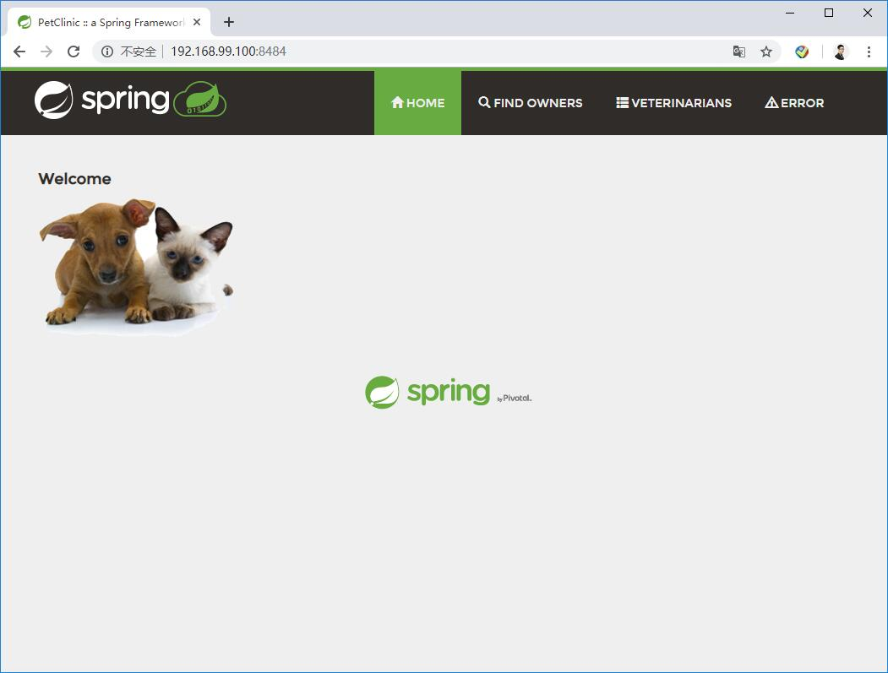
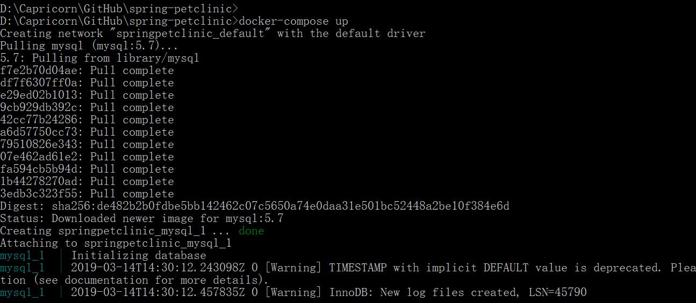
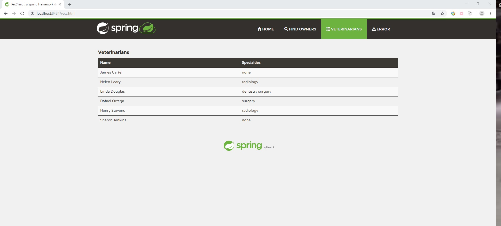
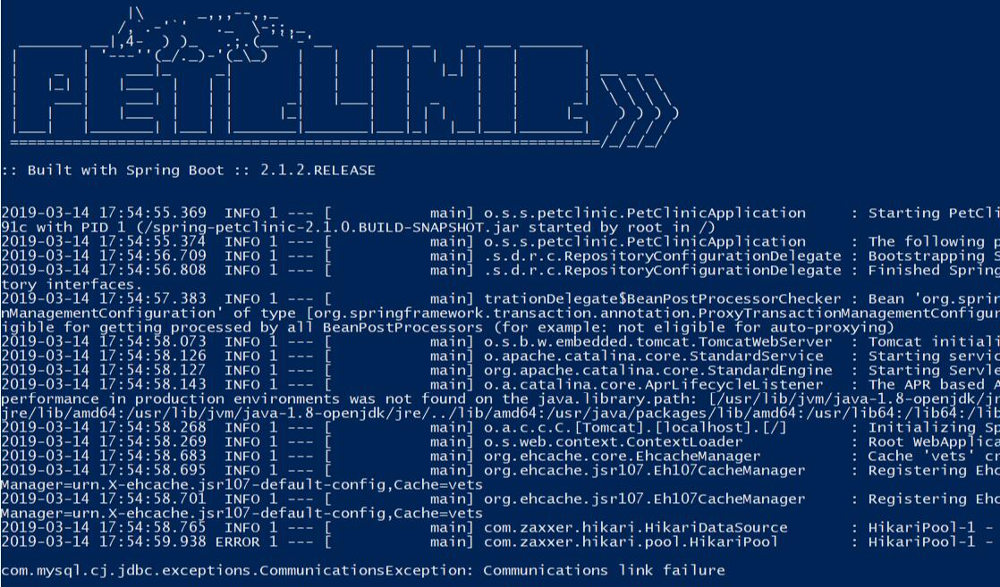
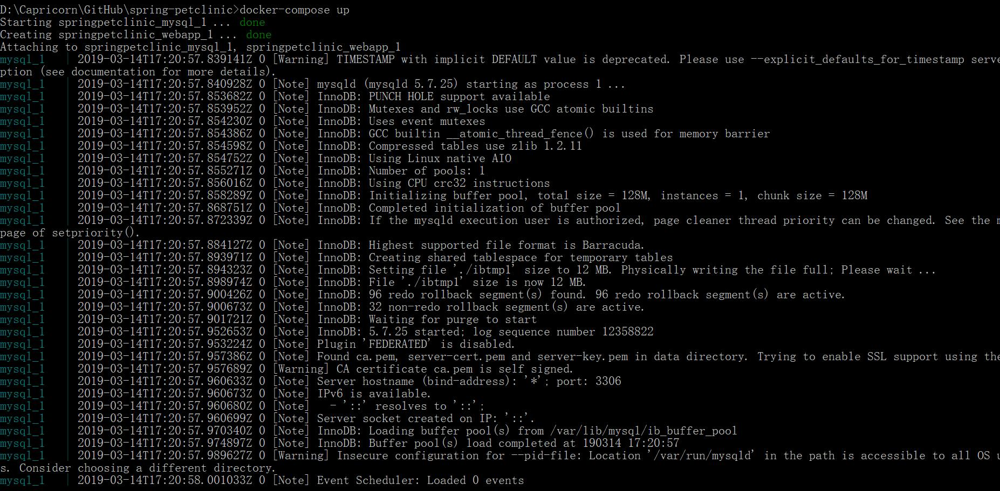
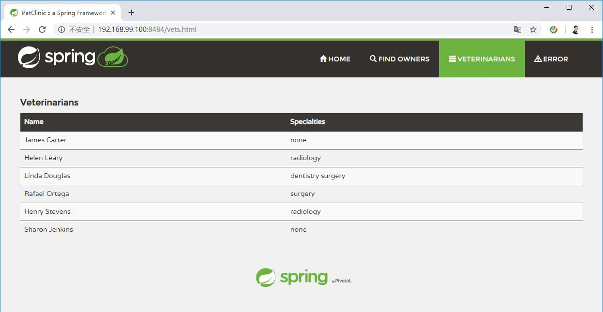

Kuangyi Zhang 1850648

Deliverables

DOCKER
1. Link to dockerfile file rather than a screen capture.
[Link](Dockerfile)
       
2. Running docker instance as shown by a ps command.

3. Browser accessing the main page of the website from your local container

DOCKER COMPOSE - MYSQL ONLY
1. The output from the docker-compose up command.

2. Browser accessing the “Veterinarians” page of the website from your local container when you run the application from the host system..

3. A section of the stack trace generated when you attempt to run the application container that has been updated to use MySQL.

DOCKER COMPOSE - APP SERVER AND MYSQL
1. Updated docker-compose.yml file containing the application server, built from your local Dockerfile, and the existing MySQL configuration. Please provide a link to this file rather than a screen capture.
[Link](newconfig/docker-compose.yml)

2. Updated application-mysql.properties file containing the URL change for the database server. Please provide a link to this file rather than a screen capture.
[Link](newconfig/application-mysql.properties)

3. The output from the docker-compose up command.

4. Browser accessing the “Veterinarians” page of the website from your local container.

